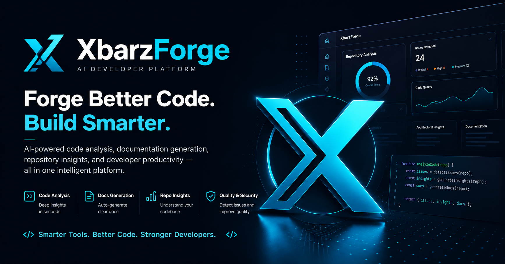

# ⚒️ XbarzForge

> **Forge Better Code. Build Smarter.**

<p align="center">
  
</p>

<p align="center">
  🚀 Live Demo:
  <br/>
  <a href="https://xbarzforge.onrender.com">
    https://xbarzforge.onrender.com
  </a>
</p>

---

## 🧠 About XbarzForge

**XbarzForge** is an AI-powered developer platform that helps developers understand, analyze, document, and explore software projects using natural language.

Built for **OpenAI Build Week 2026**, XbarzForge acts as a developer's second brain — helping engineers understand unfamiliar repositories, generate documentation, identify issues, and improve productivity.

---

# 🚀 OpenAI Build Week 2026

XbarzForge was created as a submission for **OpenAI Build Week 2026**.

The mission was to build a practical AI developer tool that demonstrates how AI can improve real software engineering workflows while remaining production-ready, deployable, and accessible.

---

# ✨ Features

## 🤖 AI Code Analysis

Analyze software projects and receive:

- Repository architecture overview
- Programming language detection
- Framework detection
- Code quality insights
- Bug detection
- Security recommendations
- Performance suggestions
- Engineering best practices

---

## 💬 AI Codebase Chat

Ask questions about your project using natural language.

Examples:

- "Explain this project"
- "Where is authentication implemented?"
- "How can I improve performance?"
- "Find possible bugs"
- "Generate onboarding documentation"

---

## 📚 Documentation Generator

Generate:

- README files
- API documentation
- Architecture documents
- Setup guides
- Developer onboarding guides

---

## 📂 Project Import

Analyze projects through:

- GitHub repositories
- ZIP uploads
- Source code uploads
- Code snippets

---

## 🔍 Global Search

Search across:

- Projects
- Documentation
- Conversations
- AI generated results

---

## 🔐 Authentication

Powered by Clerk:

- Email authentication
- Google login
- GitHub login
- Password reset
- Secure sessions
- Protected routes

---

## ⚡ Graceful AI Degradation

XbarzForge continues working even without an OpenAI API key.

Available:

✅ Authentication  
✅ Project management  
✅ Search  
✅ Upload workflows  

Disabled:

❌ AI analysis  
❌ AI chat  
❌ Documentation generation  

when AI credentials are unavailable.

---

# 🛠 Tech Stack

| Layer | Technology |
|---|---|
| Frontend | React + Vite |
| Language | TypeScript |
| Styling | Tailwind CSS |
| Components | shadcn/ui |
| Backend | Node.js + Express |
| Database | PostgreSQL |
| ORM | Drizzle ORM |
| Authentication | Clerk |
| AI Integration | OpenAI API |
| Deployment | Render |
| PWA | vite-plugin-pwa |

---

# 📁 Project Structure

```
XbarzForge/

├── src/
│   ├── components/
│   ├── pages/
│   ├── hooks/
│   └── main.tsx
│
├── public/
│   ├── favicon
│   ├── manifest
│   └── assets
│
├── api-client-react/
│
├── package.json
├── package-lock.json
├── vite.config.ts
├── render.yaml
└── README.md
```

---

# ⚙️ Local Development

## Clone Repository

```bash
git clone https://github.com/adisar6402/XbarzForge.git

cd XbarzForge
```

---

## Install Dependencies

```bash
npm install
```

---

## Configure Environment Variables

Create:

```bash
.env
```

Add required variables:

```env
VITE_CLERK_PUBLISHABLE_KEY=
CLERK_SECRET_KEY=
DATABASE_URL=
SESSION_SECRET=
OPENAI_API_KEY=
```

---

## Start Development Server

```bash
npm run dev
```

Application runs locally at:

```
http://localhost:5173
```

---

# 🏗 Production Build

Build application:

```bash
npm run build
```

Preview production build:

```bash
npm run preview
```

---

# 🌍 Deployment

XbarzForge is deployed using Render.

Live production:

🚀 https://xbarzforge.onrender.com

Deployment process:

1. Push repository to GitHub
2. Connect repository to Render
3. Add environment variables
4. Deploy service

---

# 🔑 Environment Variables

Required:

```
DATABASE_URL
CLERK_SECRET_KEY
VITE_CLERK_PUBLISHABLE_KEY
SESSION_SECRET
```

Optional:

```
OPENAI_API_KEY
```

The OpenAI API key enables:

- AI repository analysis
- AI chat
- Documentation generation
- Code explanations

Without the key, the platform remains functional with AI features disabled.

---

# 📱 Progressive Web App

XbarzForge includes PWA support.

Features:

- Installable application
- Mobile support
- Desktop support
- Web manifest
- Offline-ready landing experience
- Custom branding

---

# 🎯 Roadmap

Future improvements:

- Repository indexing
- Semantic code search
- AI commit summaries
- Pull request reviews
- Team collaboration
- GitHub App integration
- AI code generation
- Repository intelligence dashboard

---

# 👨‍💻 Author

**Abdulrahman Adisa Amuda**

**RahmanXBarz**

GitHub:

https://github.com/adisar6402

Live Demo:

https://xbarzforge.onrender.com

---

# 🏆 OpenAI Build Week 2026

Built for **OpenAI Build Week 2026**.

XbarzForge explores how AI can transform software engineering by making complex codebases easier to understand, document, and improve.

---

# 📄 License

MIT License

Copyright © 2026 Abdulrahman Adisa Amuda

---

<p align="center">
Built with ❤️ using TypeScript, React, Clerk, PostgreSQL, and OpenAI.
</p>
